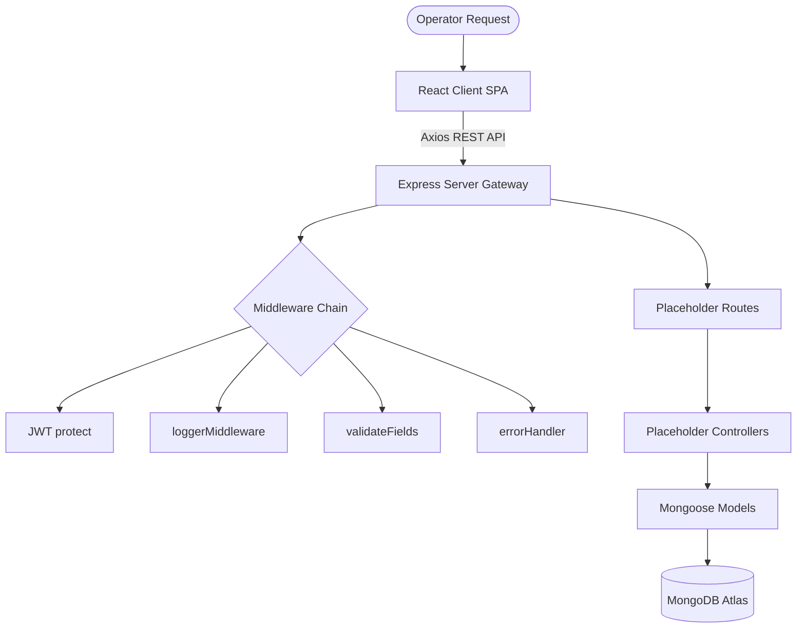

# TaskPilot AI - Multi-Agent Productivity OS Foundation

TaskPilot AI is an enterprise-grade Multi-Agent Productivity Operating System built on the MERN stack (MongoDB, Express, React, Node.js). 

This repository establishes the clean, modular project foundation and enterprise-ready architecture. It is fully scaffolded, compiles successfully, and is structured for future additions of agent logic, chat execution engines, and task handlers.

---

## 🏗️ Architecture Design



---

## 📂 Folder Structure

```
TaskPilot-AI/
├── backend/                      # Node.js + Express Gateway
│   ├── config/                   # Configuration adapters
│   ├── database/                 # Mongoose connection init
│   ├── controllers/              # Request handlers placeholders
│   ├── middleware/               # Auth, Error, Logger, Validation, 404
│   ├── models/                   # Schemas (User, Task, Chat, Message, etc.)
│   ├── routes/                   # Router definitions mappings
│   ├── services/                 # API client integrations placeholders
│   ├── agents/                   # Base agent class definitions
│   ├── prompts/                  # Text prompt templates placeholders
│   ├── utils/                    # Core helpers (ApiResponse, ApiError)
│   ├── validators/               # Input payload validators
│   └── constants/                # Global config configurations
│
├── frontend/                     # React + Vite Client
│   ├── src/
│   │   ├── components/
│   │   │   ├── ui/               # Buttons, base indicators
│   │   │   ├── common/           # Navbar, Sidebar, PageContainer, EmptyState
│   │   │   ├── cards/            # GlassCard component
│   │   │   ├── dialogs/          # Modal overlay, Confirmation dialog
│   │   │   └── loaders/          # Spinners, skeletons
│   │   ├── layouts/              # Main, Auth, Dashboard, Workspace wrappers
│   │   ├── pages/                # Workspace pages (Tasks, Planner, etc.)
│   │   ├── context/              # Theme and Toast providers
│   │   ├── routes/               # Client router configuration tables
│   │   ├── hooks/                # Custom React hook helpers
│   │   ├── services/             # Axios endpoint adapters
│   │   ├── types/                # Types definitions
│   │   └── utils/                # Common client helpers
│   ├── vite.config.js            # Vite setup
│   └── tailwind.config.js        # Design tokens config
│
├── docs/                         # Architecture documentation
├── .env.example                  # Root workspace config templates
└── package.json                  # Root monorepo workspace router
```

---

## ⚙️ Environment Variables

### Backend Configuration (`backend/.env.example`)
*   `PORT`: Gateway execution port (default `5000`)
*   `MONGODB_URI`: MongoDB Atlas connection endpoint
*   `JWT_SECRET`: Security passphrase for signing JSON Web Tokens
*   `CLIENT_URL`: Client endpoint for CORS configurations

### Frontend Configuration (`frontend/.env.example`)
*   `VITE_API_URL`: Endpoint of backend server (default `http://localhost:5000/api`)

---

## 🚀 Getting Started

### 1. Installation
To install all required backend and frontend packages concurrently, run the following command from the root workspace directory:
```bash
npm run install-all
```

### 2. Execution Commands
To run the client and server dev platforms concurrently:
```bash
npm run dev
```

*To run them separately in individual console tabs:*
*   **Run Backend Only:** `npm run server`
*   **Run Frontend Only:** `npm run client`

---

## 🔮 Future Modules Extensibility

The scaffolding is built for future enhancements:
1.  **AI Orchestrator (`backend/agents/`)**: Sub-agents can extend `BaseAgent.js` to define execution scripts.
2.  **Schema Hook Bindings (`backend/models/`)**: Business validations and password crypt hashes can be mapped directly onto mongoose schemas.
3.  **Client Integrations (`frontend/src/services/`)**: Axios client adapters can be placed to fetch route placeholders dynamically.
