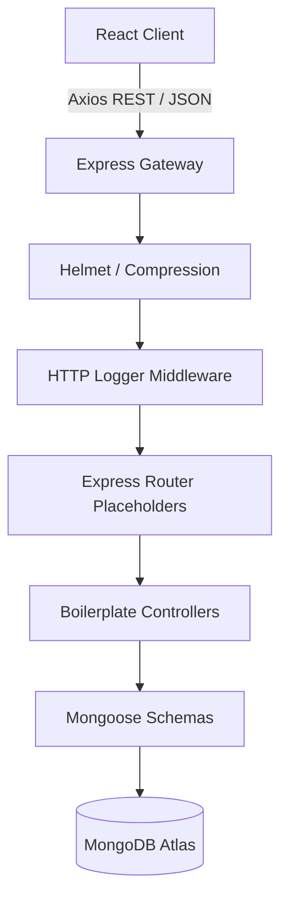

# TaskPilot AI - Enterprise Clean Architecture

This documentation details the decoupled monorepo design layout implemented for TaskPilot AI.

## Architectural Layers

### 1. Client Layer (React + Vite)
- **Page Mappings**: Segmented by dashboard, chats, and individual tools (tasks, planner, knowledge, creative, analytics).
- **Styles**: Configured to force dark mode using standard HSL tokens and glassmorphism.
- **State**: Theme and toast providers wrap layouts.

### 2. Backend Server Layer (Express + Node)
- **Utilities**:
  - `ApiResponse`: Formats unified success payloads.
  - `ApiError`: Base exception constructor.
  - `AsyncHandler`: Express middleware promise wrapper.
- **Middleware**:
  - `protect`: JWT token validation checks.
  - `validateFields`: Express validation errors scanner.
  - `errorHandler`: Global catch-all exceptions formatter.
  - `notFound`: 404 path catcher.
  - `loggerMiddleware`: Outbound HTTP log formatter.
- **Models**: Unified schemas representing User, Task, Chat, Message, GeneratedImage, Notification, and Productivity.
